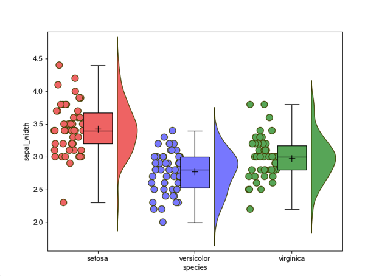
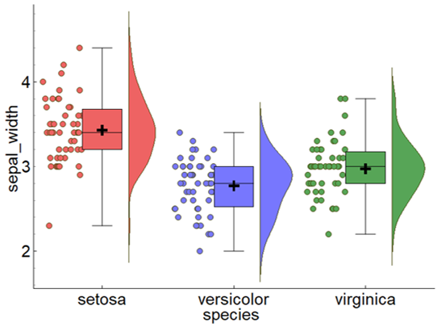
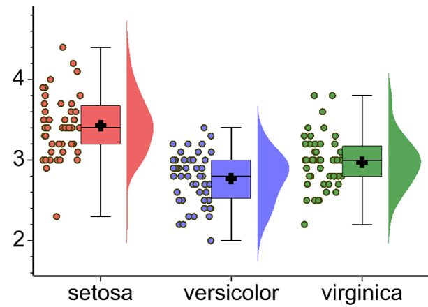
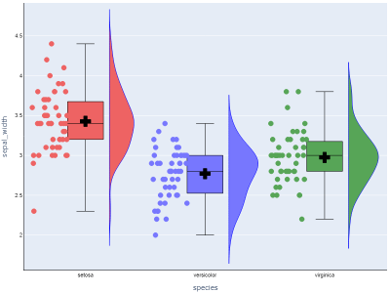
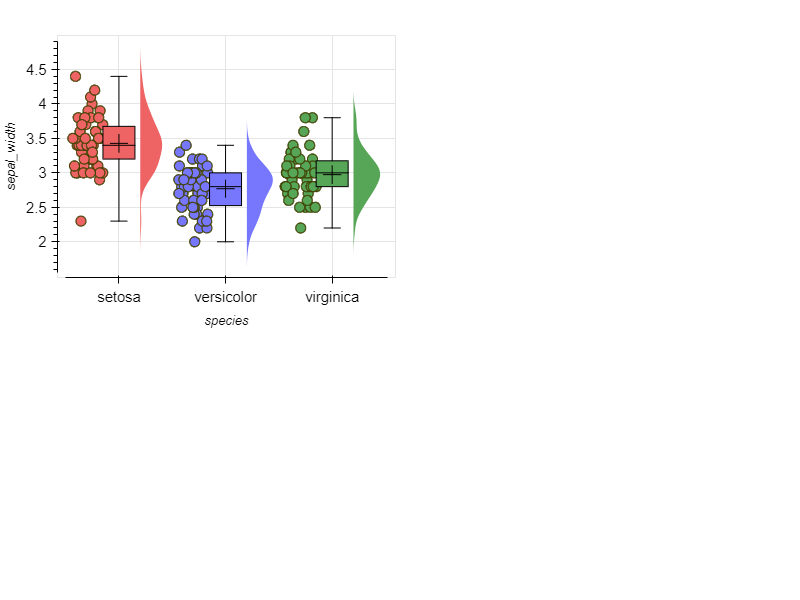

# whitecanvas

[](https://pypi.org/project/whitecanvas)
[](https://pypi.org/project/whitecanvas)

A type safe and backend independent plotting library for Python.

|matplotlib|pyqtgraph|vispy|plotly|bokeh|
|:--------:|:-------:|:---:|:----:|:---:|
||||||

-----

## Installation

```console
pip install whitecanvas -U
```

```python
import numpy as np
from whitecanvas as new_canvas

canvas = new_canvas()  # make a new canvas

# sample data
N = 10
xdata = np.linspace(0, np.pi * 2, N)
ydata = np.sin(xdata)

layer = (
    canvas
    .add_line(xdata, ydata, color="blue")
    .with_markers(color="violet", symbol="s")
    .with_edge(color="blue")
    .with_yerr(np.ones(N) / 3, capsize=0.2, color="black")
)

canvas.show()  # show canvas
```

### Backend independency

Currently supported backends are:

- `matplotlib`
- `pyqtgraph`
- `vispy`
- `plotly`
- `bokeh`
